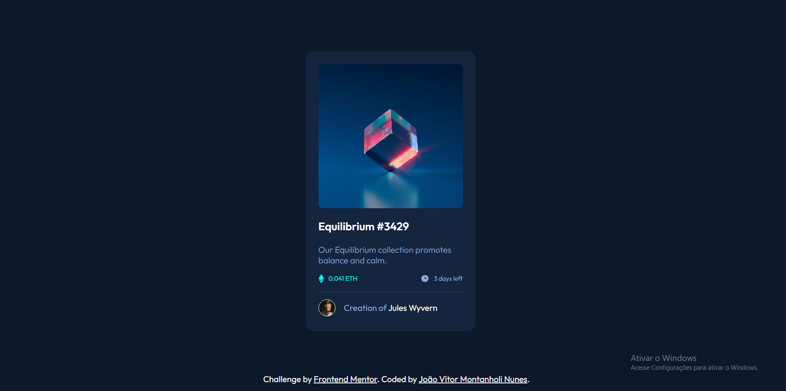

# Frontend Mentor - NFT preview card component solution

This is a solution to the [NFT preview card component challenge on Frontend Mentor](https://www.frontendmentor.io/challenges/nft-preview-card-component-SbdUL_w0U). Frontend Mentor challenges help you improve your coding skills by building realistic projects. 

## Table of contents

- [Overview](#overview)
  - [The challenge](#the-challenge)
  - [Screenshot](#screenshot)
  - [Links](#links)
- [My process](#my-process)
  - [Built with](#built-with)
- [Author](#author)

## Overview

### The challenge

Users should be able to:

- View the optimal layout depending on their device's screen size
- See hover states for interactive elements

### Screenshot

### Links

- Solution URL: [Add solution URL here](https://github.com/jmontanholi/NFT-PREVIEW-CARD-COMPONENT-MAIN)
- Live Site URL: [Add live site URL here](https://your-live-site-url.com)

## My process

### Built with

- Semantic HTML5 markup
- CSS custom properties
- Flexbox
- Git and GitHub
- VScode

## Author

- Website - [João Vítor Montanholi Nunes](https://joaomontanholi.netlify.app)
- Frontend Mentor - [@jmontanholi](https://www.frontendmentor.io/profile/jmontanholi)
- GitHub - [jmontanholi](https://github.com/jmontanholi)
- LinkedIn - [João Vítor Montanholi Nunes](https://www.linkedin.com/in/joaovitormontanholi/)
